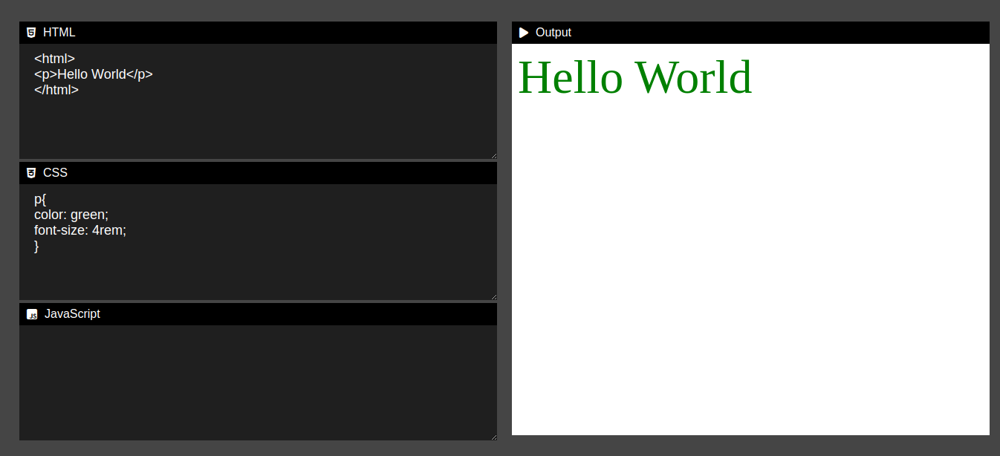

# Online Code Editor

An online code editor built using **HTML**, **CSS**, and **JavaScript**. This project allows users to write, edit, and run code directly in their browser with support for HTML, CSS, and JavaScript.



## Features

- Write and edit code in **HTML**, **CSS**, and **JavaScript**.
- Preview the output of the code in real-time.
- User-friendly interface for easy coding experience.
- Supports syntax highlighting (optional if you’ve added a library like PrismJS or CodeMirror).
- No installation required, fully browser-based.

## Demo

You can check out a live demo of the Online Code Editor here:  
[click here](https://rahulchoudhuri.github.io/OnlineCodeEditor/)

## Installation

1. Download or clone this repository:
```bash
   git clone https://github.com/RahulChoudhuri/OnlineCodeEditor.git
```

## Technologies Used
- **HTML:** Markup for creating the structure of the editor.
- **CSS:** Styling to make the editor user-friendly and visually appealing.
- **JavaScript:** Logic for running the code and interacting with the user interface.
## Contributing

Contributions are welcome! If you have any suggestions, feel free to create an issue or submit a pull request. Please make sure to follow the coding style and write tests if applicable.

